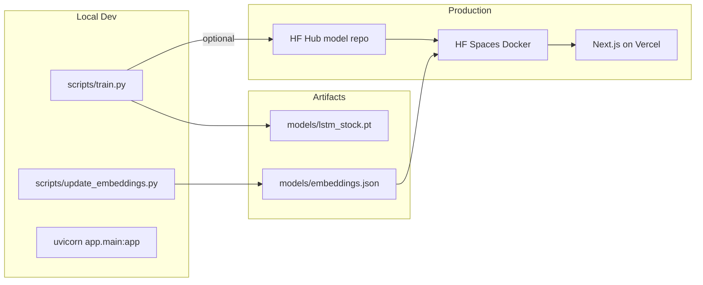

# StockPro ML Backend

FastAPI machine-learning service for Indonesian Stock Exchange (IDX) **LQ45** stocks. Fetches OHLCV data from Yahoo Finance (`TICKER.JK`) and exposes three ML endpoints:

- **LSTM price prediction** — 30-day lookback, autoregressive multi-day forecast
- **Stock similarity** — 16-dimensional embeddings with cosine similarity against precomputed LQ45 vectors
- **Anomaly detection** — custom Isolation Forest on engineered features

In production, this service runs on Hugging Face Spaces. A separate Next.js frontend on Vercel proxies requests to it.



## Repository structure

| Path | Purpose |
|------|---------|
| [`app/main.py`](app/main.py) | FastAPI app entry point |
| [`app/routers/`](app/routers/) | `/predict`, `/similar`, `/anomaly-ml` endpoints |
| [`app/models/lstm_predictor.py`](app/models/lstm_predictor.py) | LSTM architecture and inference |
| [`app/models/embeddings.py`](app/models/embeddings.py) | 16-dim embedding computation |
| [`app/services/data_fetcher.py`](app/services/data_fetcher.py) | Yahoo Finance OHLCV fetch and LQ45 tickers |
| [`app/services/feature_engineer.py`](app/services/feature_engineer.py) | 7 features, 30-day sequences |
| [`scripts/train.py`](scripts/train.py) | LSTM training script |
| [`scripts/update_embeddings.py`](scripts/update_embeddings.py) | Embedding refresh script |
| [`scripts/upload_models.py`](scripts/upload_models.py) | Manual Hugging Face Hub upload |
| [`models/`](models/) | `lstm_stock.pt` (trained locally) and `embeddings.json` (committed) |
| [`requirements.txt`](requirements.txt) | Python dependencies |
| [`Dockerfile`](Dockerfile) | Hugging Face Spaces deployment image |
| [`DEPLOYMENT.md`](DEPLOYMENT.md) | Full production deployment guide |

## Prerequisites

- Python **3.11+**
- Git
- (Optional) Hugging Face account and write token for model upload and production inference

## Setup

Clone the repo and create a virtual environment from the project root:

```bash
git clone <repo-url>
cd stock_model_predictions

python -m venv .venv
source .venv/bin/activate   # Windows: .venv\Scripts\activate

# PyTorch CPU (recommended for local training on Mac/CPU)
pip install torch==2.5.1 --index-url https://download.pytorch.org/whl/cpu

pip install -r requirements.txt
```

Create a `.env` file at the repo root (never commit this file):

```bash
HF_TOKEN=hf_xxxxxxxx
HF_MODEL_REPO=your-username/stockpro-lstm
ML_BACKEND_API_KEY=choose-a-random-secret
```

These variables are loaded by [`app/config.py`](app/config.py) via `python-dotenv`.

| Variable | Purpose |
|----------|---------|
| `HF_TOKEN` | Hugging Face write token for model upload and download |
| `HF_MODEL_REPO` | HF model repo ID, e.g. `your-username/stockpro-lstm` |
| `ML_BACKEND_API_KEY` | API key required by protected endpoints (sent as `x-api-key` header) |

## Train the LSTM model

From the repo root:

```bash
python -m scripts.train
```

What the training script does:

1. Fetches **5 years** of OHLCV data for all **49** LQ45 tickers
2. Builds 7 features per day: normalized close/volume, RSI, MACD, Bollinger width, day-of-week sin/cos
3. Creates 30-day sliding windows; target is the next-day normalized close
4. Trains for 30 epochs with Adam optimizer and Huber loss (90/10 train/val split)
5. Saves the best checkpoint to `models/lstm_stock.pt`
6. Auto-uploads to Hugging Face Hub if `HF_TOKEN` and `HF_MODEL_REPO` are set (otherwise skips with a message)

Training takes roughly 15–30 minutes on CPU. Example output:

```
Fetching data for 49 tickers...
  [1/49] AALI: 1180 sequences
  ...
Epoch  1/30  train=0.0821  val=0.0934
  ✓ Saved best model (val=0.0871)
...
Training complete. Model saved to models/lstm_stock.pt
```

## Generate embeddings

Required for the `/similar` endpoint:

```bash
python -m scripts.update_embeddings
```

This fetches 2 years of data per ticker and writes `models/embeddings.json`. The repo already includes precomputed embeddings for all 49 LQ45 stocks. Re-run and commit the file if you need to refresh them in a team workflow.

## Run the API locally

Start the server:

```bash
uvicorn app.main:app --reload --port 8000
```

Health check:

```bash
curl http://localhost:8000/health
# → {"status":"ok"}
```

Example prediction (requires a trained model at `models/lstm_stock.pt`):

```bash
curl -X POST http://localhost:8000/predict \
  -H "Content-Type: application/json" \
  -H "x-api-key: your-secret" \
  -d '{"symbol":"BBCA","days":7}'
```

### API endpoints

| Endpoint | Method | Auth | Description |
|----------|--------|------|-------------|
| `/health` | GET | none | Liveness check |
| `/predict` | POST | `x-api-key` if `ML_BACKEND_API_KEY` is set | LSTM multi-day price forecast |
| `/similar` | POST | `x-api-key` if set | Cosine-similar stocks from embeddings |
| `/anomaly-ml` | POST | `x-api-key` if set | Isolation Forest anomaly detection |

The `/predict` endpoint also accepts optional pre-fetched `closes`, `volumes`, and `timestamps` arrays in the request body. This avoids Yahoo Finance rate limits when calling from cloud IPs.

## Upload artifacts to Hugging Face (optional)

To manually upload trained artifacts:

```bash
python -m scripts.upload_models
```

Uploads `models/lstm_stock.pt` and `models/embeddings.json` to the HF model repo specified by `HF_MODEL_REPO`.

## Deployment

For production setup (Hugging Face Spaces, Vercel environment variables, GitHub Actions), see [DEPLOYMENT.md](DEPLOYMENT.md).

Summary:

1. Train locally and upload the model to a private HF Hub model repo
2. Deploy the FastAPI app to HF Spaces via the included `Dockerfile` (port 7860)
3. Set `ML_BACKEND_URL` and `ML_BACKEND_API_KEY` in your Vercel Next.js project

The HF Space downloads `lstm_stock.pt` from the Hub at runtime if it is not present locally.

## Troubleshooting

| Problem | Fix |
|---------|-----|
| `503 Model not trained yet` | Run `python -m scripts.train` |
| `503 Embeddings not built yet` | Run `python -m scripts.update_embeddings` |
| yfinance timeouts or empty data | Re-run the script; it skips failed tickers gracefully |
| HF upload skipped | Set `HF_TOKEN` and `HF_MODEL_REPO` in `.env` |
| `401 Unauthorized` | Pass the correct `x-api-key` header matching `ML_BACKEND_API_KEY` |
